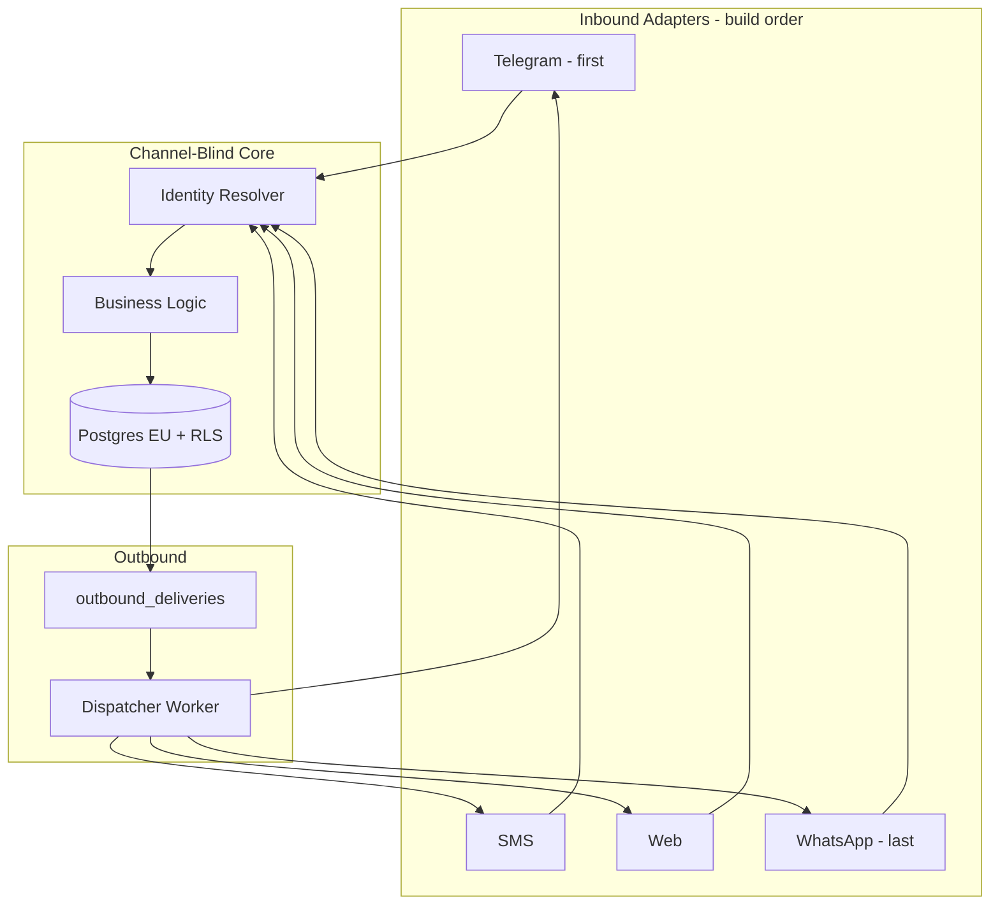

# Cohort — Channel-Native Slow-Dating Platform

**Status:** Implemented (v3). Deploy to Supabase EU and configure channel secrets.

**Brand:** [Cohort](https://meetcohort.co) — namespace `cohort` for repo, env prefix (`COHORT_*`), Supabase project label, bot handles.

**Schema naming:** Table names stay **clean and domain-specific** (`weekly_rounds`, `round_members`, …). The brand is "Cohort"; we do **not** revive old `cohort_*` table names from the prior web product.

**Infrastructure:** Supabase **EU region** (mandatory — GDPR).

**Launch region:** `region_key = berlin`, ~199 real committed users. Public Berlin launch targets **WhatsApp** (where users committed); engineering dogfoods on **Telegram** first.

---

## 1. Architecture

**Shape:** Channel-blind core + thin inbound adapters + outbound dispatcher + identity resolver.



### Layer responsibilities

| Layer | Responsibility |
|-------|----------------|
| **Inbound adapter** | Webhook verify → `(channel, external_id)` → `user_id` → `CoreAction` |
| **Core** | All business logic; channel-agnostic |
| **Identity resolver** | Canonical `users.id`; never treat channel handle as user |
| **Dispatcher** | Outbox → provider APIs; idempotent delivery |
| **Relay** | Mediated post-reveal chat; hide underlying channel IDs |

### Core actions

`OnboardingMessage | CompleteOnboarding | SendSpark | RespondSpark | SubmitThreadTurn | SubmitContract | SendRelayMessage | BlockUser | ReportUser | StripeWebhook`

State changes + `outbound_deliveries` in one **transaction**.

### Project layout

```
cohort/
├── supabase/
│   ├── migrations/
│   └── functions/
│       ├── core/
│       ├── adapters/telegram/    # first — full journey
│       ├── adapters/sms/
│       ├── adapters/web/
│       ├── adapters/whatsapp/    # last adapter
│       ├── dispatcher/
│       ├── ai/                     # ai-proxy only
│       └── _shared/
├── prompts/
│   ├── onboarding/
│   ├── matching/
│   └── thread-facilitation/
└── web/                            # before WhatsApp adapter
```

---

## 2. Data model

### 2.1 Identity 🔒

```sql
users (
  id uuid PK,
  date_of_birth date,             -- collected for self_declared gate
  age_verified_at timestamptz,    -- blocks round placement until set
  age_verification_method text,   -- launch: 'self_declared'; pluggable later
  primary_phone text UNIQUE,
  whatsapp_contact_consent_at timestamptz,
  preferred_outbound_channel text,
  ...
)

channel_identities (channel, external_id, user_id, UNIQUE(channel, external_id))
phone_verifications (...)
channel_link_tokens (...)
```

**Age gate (locked for launch):** `age_verification_method = 'self_declared'` — user states date of birth; round placement blocked until `age_verified_at` set. Gate remains pluggable for stronger methods later without schema churn.

**Radar (non-blocking):** German JMStV may eventually require more than click-through DOB for adults-only offerings. Treat `self_declared` as starting point, not permanent.

### 2.2 Profile & AI interview

```sql
profiles (
  user_id PK, region_key, bio_structured jsonb,
  embedding vector(1536), onboarding_status, ...
)

ai_interview_sessions (
  id, user_id, prompt_version,
  messages jsonb[],              -- lean per-turn chunks
  running_summary jsonb,         -- summarise older turns → bio_structured
  structured_output jsonb, completed_at
)
```

### 2.3 Geographic expansion

```sql
regions (region_key PK, status, opened_at, min_suggestions_per_round)
region_waitlist (region_key, user_id, email, phone, source, created_at)
region_demand_stats (region_key, waitlist_count, updated_at)
```

- Launch: **`berlin`** open.
- Expand city-by-city on waitlist demand; **manual ops** to open a region.
- **No cross-region matching.**
- Thin week → `no_round_this_week` (never padded / reason-less).

### 2.4 Weekly rounds, sparks, threads

`weekly_rounds`, `round_members`, `weekly_quotas`, `match_suggestions` (mandatory `reason_text`), `sparks`, `threads`, `thread_turns`, `contracts`, `messages`, `date_alignment_*`, `date_plans`.

**Thread facilitation:** AI-facilitated natural turns; next question depends on prior answer; soft `turn_deadline`.

**Consent gates:** spark accept → contract mutual yes → photo reveal.

### 2.5 Mediated relay 🔒

`relay_threads`, `relay_endpoints`, `relay_messages` — bot-mediated; no peer `external_id` exposure.

### 2.6 Trust & safety 🔒

`blocks`, `reports`, `moderation_actions`, `media_moderation_jobs`, `abuse_fingerprints`, `behavior_events`, `rate_limit_log`, `user_roles` + SECURITY DEFINER helpers.

### 2.7 Dispatcher

`domain_events`, `outbound_deliveries` (idempotency_key UNIQUE, retry/backoff).

Quiet-week templates: functional only (`round_ready`, `spark_*`, `thread_prompt`, `contract_*`, `reveal_*`, `safety_*`, `no_round_this_week`). No engagement nudges (`cohort_config.between_rounds_mode = quiet`).

### 2.8 Payments & config

```sql
subscriptions (...)
entitlements (tier, sparks_per_week, features jsonb)  -- flexible; no invented SKUs yet

cohort_config (key PK, value jsonb, updated_at)
```

**Spark budget (locked):** `sparks_per_week_free = 5`, weekly reset, entitlement-driven.

**Monetisation (provisional, not blocking):** Free = 5/week. Paid lever TBD — entitlement schema stays flexible. Selling "more sparks" may undermine scarcity philosophy; future paid value might be convenience/visibility rather than unlimited sparks. No tier SKUs in schema until decided.

---

## 3. Dispatcher (exactly-once)

Transactional outbox + `idempotency_key` + `pending→sending` conditional update + exponential backoff (max 8 → `dead`).

Worker: `dispatcher-run` cron ~30s, `FOR UPDATE SKIP LOCKED LIMIT 50`.

---

## 4. AI matchmaker

**Proxy:** `ai-proxy` — sole `ANTHROPIC_API_KEY` holder.

### Model config (locked — `cohort_config`, not hardcoded)

| Config key | Model | Rationale |
|------------|-------|-----------|
| `ai.model.onboarding` | `claude-sonnet-4-6` | Multi-turn interview; cost/quality balance |
| `ai.model.facilitation` | `claude-sonnet-4-6` | High-frequency per-turn facilitation |
| `ai.model.matching` | `claude-opus-4-7` | Core product promise; low volume per user per week. Downgrade to `claude-sonnet-4-6` is a one-line config change if cost bites |

Reference pricing (planning): Opus $5/$25, Sonnet $3/$15, Haiku $1/$5 per Mtok (in/out).

### Cost control (apply from day one)

| Technique | Where |
|-----------|--------|
| **Prompt caching** | Stable matchmaker persona / system blocks (~90% cheaper cached input) |
| **Lean transcripts** | Onboarding: summarise older turns into `running_summary` / `bio_structured`; don't resend full raw history indefinitely |
| **Per-turn session chunks** | `ai_interview_sessions` persisted each turn (stateless API) |
| **Batch API** | Weekly matching run (50% cheaper); not latency-sensitive — runs ahead of round formation |

### Matching rules (unchanged)

- Rule-based **pre-filter** only (region, lane, blocks, moderation, age gate).
- User-facing suggestions **always** include AI `reason_text`.
- No match → `no_round_this_week`.
- AI-down degraded mode: internal only; never reason-less user-facing suggestions; log `matching_incident`.

**Constraints:** AI-labelled (EU AI Act); facilitator not substitute; no AI personas; prompts in `/prompts/` with `prompt_version`.

---

## 5. Channel strategy (locked)

| Track | When | Purpose |
|-------|------|---------|
| **Telegram** | Phases 2–7+ | **First and primary build channel.** Full journey E2E: identity → outbox → adapter → relay → core. Dogfood and early testers here. |
| **SMS** | Phase 10 | Fallback adapter |
| **Web** | Phase 11 | React/Vite channel |
| **WhatsApp** | Phase 12 (last adapter) | Berlin public launch channel (~199 users). Thin adapter on same core — not a rewrite. |

### WABA verification (parallel, non-code — start early)

~199 Berlin users are on WhatsApp. **Begin Meta WABA verification during Phase 0** (Facebook Business Manager, documentation) — independent of code, often **days to weeks** for dating. Building WhatsApp last is fine; **starting Meta paperwork last is not.**

When WhatsApp adapter ships (Phase 12): implement `whatsapp_contact_consent_at` + `consent_records` before any proactive outbound (weekly round messages). Undocumented proactive messaging risks number ban.

**Berlin public launch** happens when WhatsApp adapter + WABA are ready — not when Telegram dogfood is ready. Telegram proves the product; WhatsApp delivers it to the committed cohort.

---

## 6. Build phases

| Phase | Scope | Checkpoint |
|-------|-------|------------|
| **0 — Foundation** | Supabase EU; core tables; `cohort_config` with model keys + spark defaults; RLS deny-default; **kick off WABA paperwork** | Schema review |
| **1 — Identity** 🔒 | Phone OTP, resolver, link tokens, **self_declared age gate** | Human review |
| **2 — Dispatcher** 🔒 | Outbox + **Telegram** outbound | Human review |
| **3 — Telegram inbound** | Webhook adapter | E2E loop |
| **4 — Core journey** | weekly_rounds, sparks, AI threads, contracts, reveal | Consent tests |
| **5 — Relay** 🔒 | Mediated messaging on Telegram | Human review — leak test |
| **6 — Trust & safety** 🔒 | blocks, reports, moderation, fingerprints, media queue | Human review |
| **7 — Matching** | pgvector, lane filters, Opus matching (batch), round cron | |
| **8 — Payments** 🔒 | Stripe, entitlements (flexible, no SKU invention) | Human review |
| **9 — AI hardening** | Prompt caching, transcript summarisation, batch matching job | Cost metrics |
| **10 — SMS** | Twilio adapter | |
| **11 — Web** | React/Vite + web adapter | |
| **12 — WhatsApp** | WABA hookup, consent trail, WA adapter + templates | Policy review; **Berlin launch gate** |

🔒 = tests-first + human review.

**Deferred:** synthetic hosts, `is_host` density tooling (not load-bearing; transparent label if ever added).

---

## 7. Between-rounds engagement (locked)

Intentional quiet. Functional outbounds only. Config: `between_rounds_mode = quiet`.

---

## 8. Geographic expansion

Berlin day-one density (~199 real users). Demand-driven expansion via `region_waitlist`. No synthetic padding. `no_round_this_week` when AI cannot reason confidently.

---

## 9. Testing strategy

Identity resolver, dispatcher idempotency, consent gates, spark budget (5/week + entitlements), no-reason matching rejection, degraded AI incidents, relay leak tests, RLS isolation, quiet-mode template allowlist, age gate blocks rounds until DOB + `self_declared`.

---

## 10. Risks

| Risk | Mitigation |
|------|------------|
| WABA delay blocks Berlin launch | Start Meta verification Phase 0; Telegram dogfood meanwhile |
| WABA ban | `whatsapp_contact_consent_at` + `consent_records` at WA build |
| Dispatcher duplicates | Transactional outbox |
| Identity leak | Relay review + automated leak tests |
| AI cost overrun | Caching, lean transcripts, batch matching; Sonnet downgrade for matching is config-only |
| JMStV stronger age checks | Pluggable `age_verification_method` |
| Paid sparks undermining scarcity | Flexible entitlements; SKUs decided later — see OPEN_QUESTIONS |

---

## 11. Reference logic (prior web product)

Port patterns only from `cohort-spark-reveal`: spark lifecycle, thread→contract→reveal, lane classification, trust stack, RLS server-writes.

**Do not port:** `cohort_*` table names, pull notifications, direct chat, rigid 4-step thread, synthetic hosts, silent rule-based matching.

---

## 12. Resolved decisions

| Topic | Decision |
|-------|----------|
| Brand / namespace | **Cohort** (`cohort/`, `COHORT_*`, meetcohort.co) |
| Schema tables | `weekly_rounds`, etc. — **not** old `cohort_*` names |
| AI models | Sonnet onboarding + facilitation; Opus matching (config-swappable) |
| AI cost | Prompt caching, lean transcripts, batch matching — day one |
| Age verification | `self_declared` at launch; pluggable later |
| Channels | Telegram first (full build); WhatsApp **last** adapter |
| WABA | Parallel paperwork from Phase 0 |
| Cold start | Berlin ~199 real users; geo expansion |
| Sparks | 5/week, config + entitlements |
| Between rounds | Quiet |
| Data residency | Supabase EU |

Future items: [OPEN_QUESTIONS.md](OPEN_QUESTIONS.md).

---

## Phase 0 — first concrete step (on green light)

1. **Create repo** `cohort/` with `supabase init` targeting **EU region**.
2. **Migration `00001_foundation`:** `users`, `channel_identities`, `regions` (seed `berlin` open), `region_waitlist`, `domain_events`, `outbound_deliveries`, `cohort_config` with defaults:
   - `ai.model.onboarding` → `claude-sonnet-4-6`
   - `ai.model.facilitation` → `claude-sonnet-4-6`
   - `ai.model.matching` → `claude-opus-4-7`
   - `sparks_per_week_free` → `5`
   - `between_rounds_mode` → `quiet`
3. **RLS:** deny-all baseline policies; service-role-only on outbox/events.
4. **Parallel (you):** Begin WABA / Facebook Business Manager verification for dating use case.
5. **Checkpoint:** Schema review before Phase 1.

No edge functions, adapters, or AI code in Phase 0.
